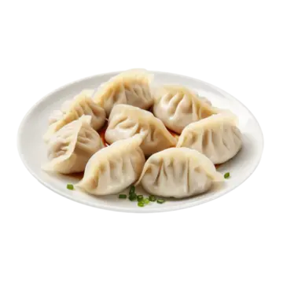

# ** Data Notations Test 1 Food and Drinks**

## Our team

1. Yevhen Pyrih
    * Yevhen Pyrih
    * 2,3
1. Maksym Prylukin
    * Maksym Prylukin
    * 4,5
1. Oleksandr Vasyliev
    * Oleksandr Vasyliev
    * 1,6
## INTRODUCTION 
This introdcution will tell you about food and drinks of different countries. For example Polish food is mostly maid out of sour and salty dishes such as - Bigos,Gołąbki,Żurek,Pierogi and Borscht. Most of western Europe has alike national dishes poland,ukraine and russia has Borscht in their national dishes list, among many others.  
Countries that has more sunny weather they grow more fresh vegies and fruit and that is a reason that Italy has good wine because of their grape farms all over the country.Just like Greace has very good national dishes maid out of fresh vegies for example Greek salad maid out of - Bell pepper, Red onion, English cucomber, Grape tomatoes and many others.  
Northern europe has more sea food because their cold weather is not good for growing fresh vegies, that is why fresh tomatoes, cucumbers, olives and apples are expansive there. However in one of the countries located in northern part of europe Norway they have decent sea food dishes like -Fish soup,Bergen Fish Soup,Fish ball and Fårikål.  
## DATA
Table below will tell you about some Polish dishes and their ingredients. Table will mantion only a fraction of the whole ingredients list.
| Bigos | Gołąbki | Pierogi  | Borscht |
|--|--|--|--|
| Bay leaves | White Cabbage | Egg | Carrots |
| Tomato paste |  ground pork | Salt | Tomato paste |
| Prunes | ground beef | Water | Beetroot |
## IMG

:max_bytes(150000):strip_icc()/84450-ukranian-red-borscht-soup-ddmfs-0220-3x4-ingredients-920dfd0488a841c4b282dac0bf3a0185.jpg)

